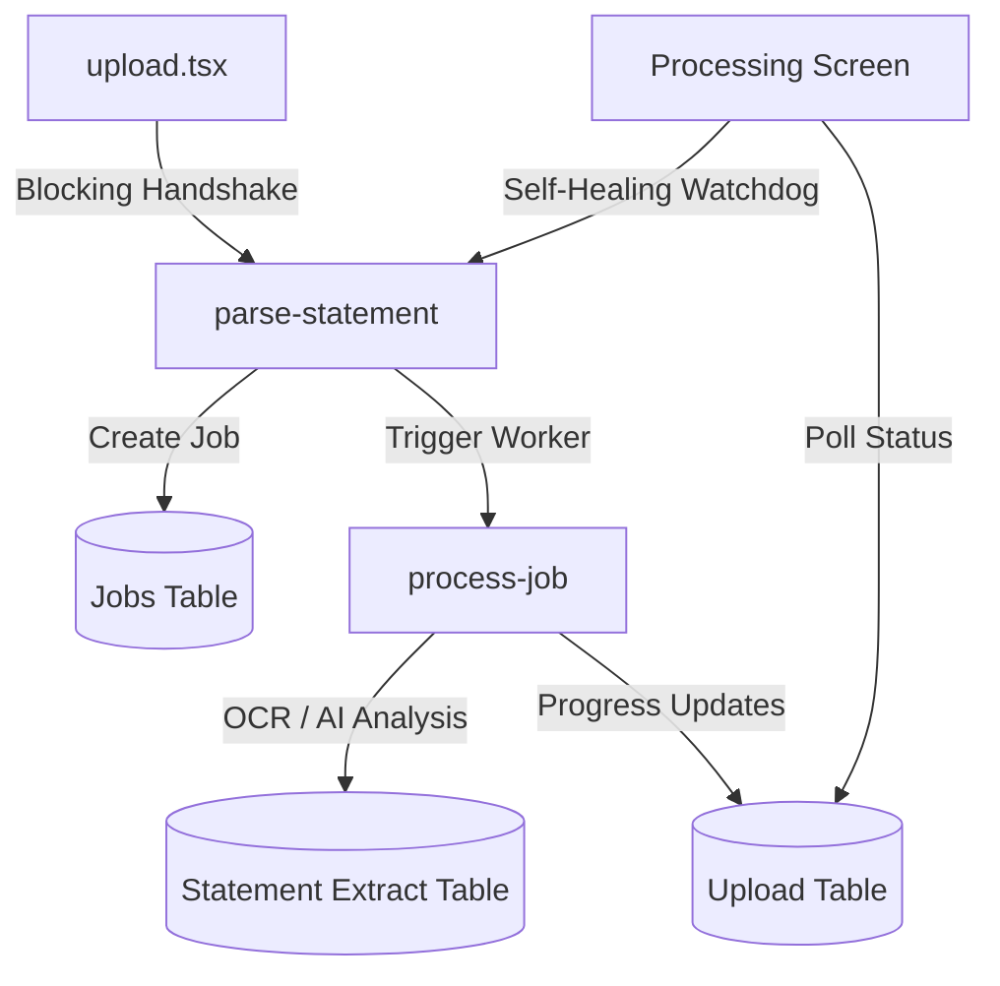

# North Repository Navigation

Guide for navigating the North Finance App codebase and understanding the safety boundaries.

## Repository Structure

- `app/`: Expo Router application screens (Frontend).
- `components/`: Reusable UI components.
- `lib/`: Utility logic, helpers, and service layers.
- `supabase/`: 
  - `functions/`: Edge Functions (The "Agents").
  - `migrations/`: Database schema versioning.
- `assets/`: Static image and font assets.
- `constants/`: App-wide configuration and theme tokens.

## 🔴 RED ZONES (Manual Approval Required)

The following areas are critical to the application's stability and security. **No automated changes** are allowed here:

1. **`supabase/functions/`**: The core logic for processing statements (parse-statement, process-job).
2. **`supabase/migrations/`**: All database schema changes.
3. **`PIPELINE_STANDARDIZATION.sql`**: The master source-of-truth for the database contract.
4. **Auth & Security**: Any logic involving `guest_token`, RLS policies, or session management.
5. **Protocol Logic**: Invariant mechanics like the 15/45/70/92 progress stages and the 3s self-healing trigger.

## 🟢 GREEN ZONES (Safe for Automation)

- UI components in `components/`.
- Tab screens in `app/(tabs)/`.
- Documentation in `docs/` and `*.md`.
- Utility helpers like `lib/haptics.ts`.

## The Ingestion Pipeline

**Traceability**: Every ingestion flow uses a `trace_id` propagated through headers. Logs are centralized in the `debug_events` table.
